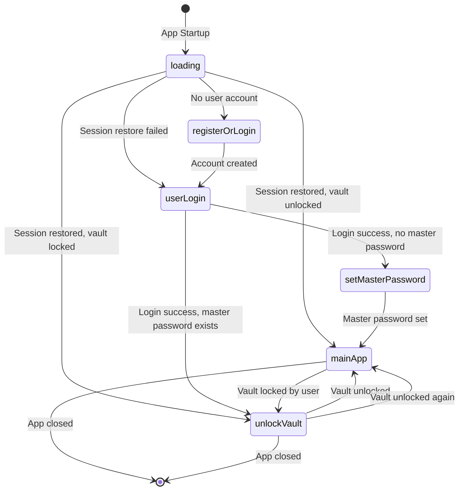
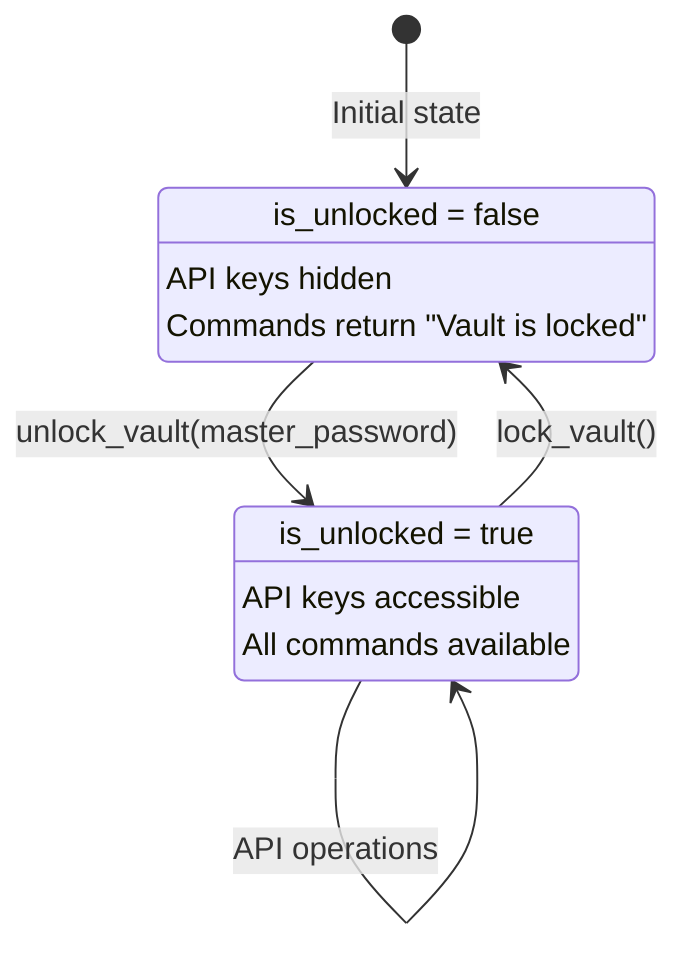
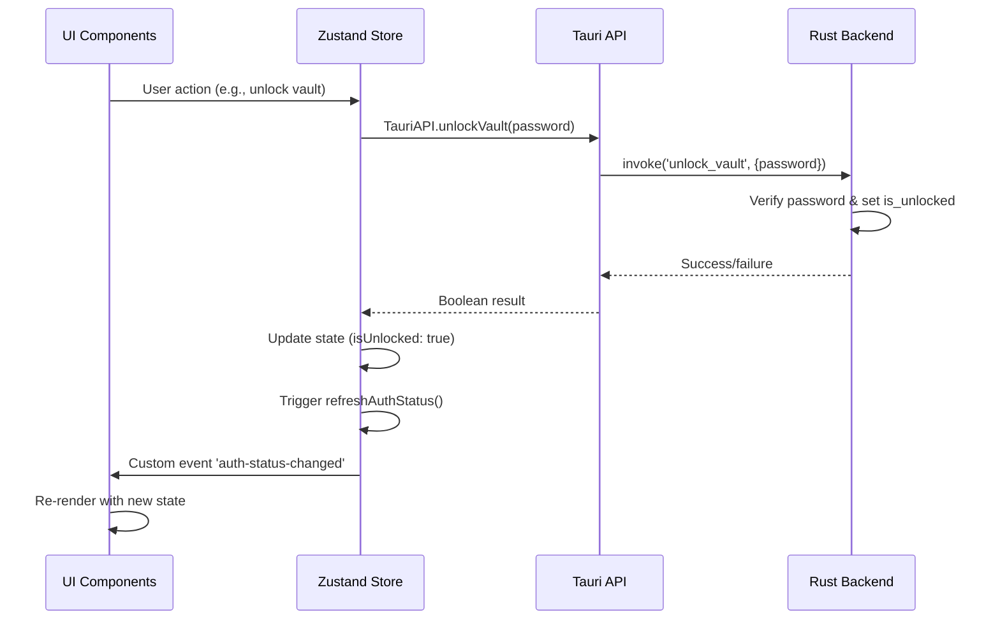
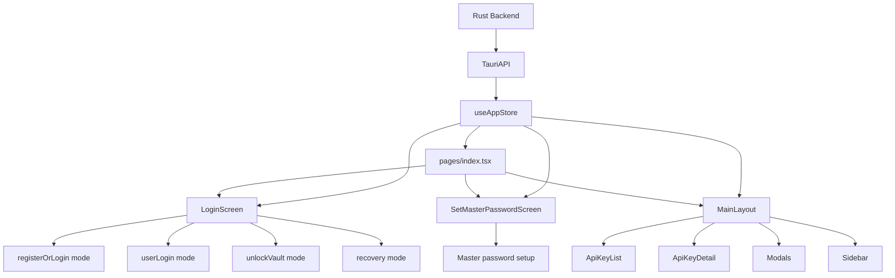

# KeyKeeper - Authentication & State Management Logic

## 📋 Overview

KeyKeeper è un gestore sicuro di API keys con autenticazione multi-livello e persistenza locale. Questo documento descrive in dettaglio tutte le logiche di autenticazione, gestione dello stato e flussi di sicurezza.

## 🏗️ Architecture Overview

```
┌─────────────────────────────────────────────────────────────────┐
│                        FRONTEND (Next.js)                      │
├─────────────────────────────────────────────────────────────────┤
│  pages/index.tsx (Auth Controller)                             │
│  ├── LoginScreen (Multi-modal auth)                           │
│  ├── SetMasterPasswordScreen (Password setup)                 │
│  ├── BiometricLogin (Alternative auth)                        │
│  └── MainLayout (Post-auth interface)                         │
│                                                                 │
│  lib/store.ts (Zustand State Management)                      │
│  ├── Authentication state                                      │
│  ├── API key management                                        │
│  └── UI state management                                       │
│                                                                 │
│  lib/tauri-api.ts (Backend Interface)                         │
│  ├── Vault operations                                          │
│  ├── User management                                           │
│  └── Session handling                                          │
├─────────────────────────────────────────────────────────────────┤
│                     TAURI BRIDGE                               │
├─────────────────────────────────────────────────────────────────┤
│                      BACKEND (Rust)                            │
├─────────────────────────────────────────────────────────────────┤
│  src-tauri/src/main.rs                                         │
│  ├── Authentication Commands (56 total)                       │
│  ├── Vault Management                                          │
│  ├── VSCode Integration (HTTP Server)                         │
│  ├── Session Persistence                                       │
│  └── Security & Audit Logging                                  │
│                                                                 │
│  Local Storage                                                  │
│  ├── vault.json (Encrypted API keys)                          │
│  └── Audit logs                                                │
└─────────────────────────────────────────────────────────────────┘
```

## 🔐 Authentication Flow States

### State Machine Diagram



### Auth Steps Detailed

| State | Description | Required Actions | Next State |
|-------|-------------|------------------|------------|
| `loading` | Initial app startup | Check user account, session restore | `registerOrLogin`, `userLogin`, `unlockVault`, `mainApp` |
| `registerOrLogin` | New user registration | Create user account | `userLogin` |
| `userLogin` | User authentication | Login with credentials | `setMasterPassword`, `unlockVault` |
| `setMasterPassword` | Master password setup | Set encryption password | `mainApp` |
| `unlockVault` | Vault decryption | Enter master password | `mainApp` |
| `mainApp` | Full application access | All features available | `unlockVault` (on lock) |

## 🔄 Authentication Flow Logic

### 1. App Startup Sequence

```typescript
// pages/index.tsx - checkAuthStatus()
const checkAuthStatus = useCallback(async () => {
  // Step 1: Check if user account exists
  const userAccountCreated = await TauriAPI.isUserAccountCreated()
  if (!userAccountCreated) {
    setCurrentAuthStep('registerOrLogin')
    return
  }

  // Step 2: Try to restore session
  const sessionRestored = await TauriAPI.restoreSessionOnStartup()
  setIsUserLoggedIn(sessionRestored)
  
  if (!sessionRestored) {
    setCurrentAuthStep('userLogin')
    return
  }

  // Step 3: Check master password
  const masterPasswordSet = await TauriAPI.isMasterPasswordSet()
  setHasMasterPassword(masterPasswordSet)
  
  if (!masterPasswordSet) {
    setCurrentAuthStep('setMasterPassword')
    return
  }

  // Step 4: Check vault unlock status
  const vaultUnlocked = await TauriAPI.isVaultUnlocked()
  setIsUnlocked(vaultUnlocked)
  
  if (!vaultUnlocked) {
    setCurrentAuthStep('unlockVault')
    return
  }

  // Step 5: Ready for main app
  setCurrentAuthStep('mainApp')
}, [dependencies])
```

### 2. Session Persistence Logic

```rust
// src-tauri/src/main.rs
#[tauri::command]
async fn restore_session_on_startup(state: State<'_, AppState>) -> Result<bool, String> {
    // Check if user account exists but DO NOT auto-unlock vault
    // This only restores user login state, vault still requires master password
    let vault_guard = state.vault.lock().await;
    let has_user = vault_guard.user_account.is_some();
    drop(vault_guard);
    
    if has_user {
        log_audit_event(&state, "restore_session", "session", None, true, None).await;
        Ok(true)
    } else {
        Ok(false)
    }
}
```

**Security Note**: Session restoration ≠ vault unlock. User authentication persists, but vault encryption requires master password.

## 🔒 Vault Lock/Unlock Mechanics

### Vault State Diagram



### Lock/Unlock Implementation

```rust
// Unlock vault with master password
#[tauri::command]
async fn unlock_vault(password: String, state: State<'_, AppState>) -> Result<bool, String> {
    let vault_guard = state.vault.lock().await;
    
    if let Some(stored_hash) = &vault_guard.master_password_hash {
        let is_valid = verify(&password, stored_hash).map_err(|e| e.to_string())?;
        if is_valid {
            drop(vault_guard);
            *state.is_unlocked.lock().await = true;
            log_audit_event(&state, "unlock_vault", "vault", None, true, None).await;
            Ok(true)
        } else {
            log_audit_event(&state, "unlock_vault", "vault", None, false, Some("Invalid password")).await;
            Ok(false)
        }
    } else {
        Err("Master password not set. Please set it first.".to_string())
    }
}

// Lock vault (secure memory cleanup)
#[tauri::command]
async fn lock_vault(state: State<'_, AppState>) -> Result<(), String> {
    *state.is_unlocked.lock().await = false;
    log_audit_event(&state, "lock_vault", "vault", None, true, None).await;
    Ok(())
}
```

### Frontend Vault Operations

```typescript
// lib/store.ts
unlockVault: async (password: string) => {
  const success = await TauriAPI.unlockVault(password)
  set({ isUnlocked: success })
  
  if (success) {
    await get().loadApiKeys() // Load API keys after unlock
    await integrationService.initialize(settings)
  }
  return success
},

lockVault: async () => {
  await TauriAPI.lockVault()
  integrationService.reset()
  
  // Secure memory cleanup - clear all sensitive data
  set({
    isUnlocked: false,
    apiKeys: [],           // Clear from frontend memory
    filteredKeys: [],
    selectedKey: null,
    searchQuery: '',
    showAddModal: false,   // Close sensitive modals
    showEditModal: false,
    showDeleteModal: false,
    error: null
  })
}
```

## 📊 State Management Architecture

### Zustand Store Structure

```typescript
interface AppState {
  // Authentication State
  isUnlocked: boolean           // Vault encryption status
  isUserLoggedIn: boolean       // User session status  
  hasMasterPassword: boolean    // Master password configured
  
  // Application State
  isLoading: boolean
  error: string | null
  
  // Data State
  apiKeys: ApiKey[]
  filteredKeys: ApiKey[]
  selectedKey: ApiKey | null
  
  // UI State
  searchQuery: string
  sidebarCollapsed: boolean
  showAddModal: boolean
  showEditModal: boolean
  showDeleteModal: boolean
  showSettingsModal: boolean
  
  // Actions
  unlockVault: (password: string) => Promise<boolean>
  lockVault: () => Promise<void>
  loadApiKeys: () => Promise<void>
  // ... other actions
}
```

### State Synchronization



## 🛡️ Security Features

### 1. Password Security

```rust
// Master password hashing (bcrypt)
let salt = generate_salt();
let hash = bcrypt::hash(&password, DEFAULT_COST)?;

// Password verification
let is_valid = bcrypt::verify(&password, &stored_hash)?;
```

### 2. Vault Encryption

```rust
// AES-256-GCM encryption for vault data
let cipher = Aes256Gcm::new(Key::<Aes256Gcm>::from_slice(key));
let nonce = Aes256Gcm::generate_nonce(&mut OsRng);
let ciphertext = cipher.encrypt(&nonce, data.as_ref())?;
```

### 3. Key Derivation

```rust
// PBKDF2 with 100,000 iterations (OWASP recommended)
pbkdf2_hmac::<Sha256>(&password.as_bytes(), &salt, 100_000, &mut key);
```

### 4. Audit Logging

```rust
async fn log_audit_event(
    state: &State<'_, AppState>, 
    action: &str, 
    resource_type: &str, 
    resource_id: Option<&str>, 
    success: bool, 
    error_message: Option<&str>
) {
    let audit_log = AuditLog {
        id: format!("audit_{}", get_utc_timestamp_millis()),
        timestamp: get_utc_timestamp(),
        action: action.to_string(),
        resource_type: resource_type.to_string(),
        resource_id: resource_id.map(|s| s.to_string()),
        user_id: Some("local_user".to_string()),
        ip_address: Some("127.0.0.1".to_string()),
        user_agent: Some("KeyKeeper Desktop".to_string()),
        success,
        error_message: error_message.map(|s| s.to_string()),
    };
    
    let mut vault_guard = state.vault.lock().await;
    vault_guard.audit_logs.push(audit_log);
    
    // Keep only last 1000 audit logs
    if vault_guard.audit_logs.len() > 1000 {
        vault_guard.audit_logs.remove(0);
    }
}
```

## 🔧 VSCode Integration

### HTTP Server Architecture

```rust
// Start HTTP server for VSCode extension
#[tauri::command]
async fn start_vscode_server(state: State<'_, AppState>) -> Result<String, String> {
    let listener = TcpListener::bind("127.0.0.1:27182").await?;
    let vault = Arc::clone(&state.vault);
    let is_unlocked = Arc::clone(&state.is_unlocked);
    let vault_path = state.vault_path.clone();
    
    tokio::spawn(async move {
        while running {
            match listener.accept().await {
                Ok((stream, addr)) => {
                    tokio::spawn(handle_vscode_connection_enterprise(
                        stream, vault.clone(), is_unlocked.clone(), vault_path.clone(), addr
                    ));
                }
            }
        }
    });
}
```

### API Endpoints

| Endpoint | Method | Description | Tauri Command |
|----------|--------|-------------|---------------|
| `/api/keys` | GET | Get all API keys | `get_api_keys` |
| `/api/keys` | POST | Create new API key | `add_api_key` |
| `/api/keys/{id}` | PUT | Update API key | `update_api_key` |
| `/api/keys/{id}` | DELETE | Delete API key | `delete_api_key` |
| `/api/keys/search` | GET | Search API keys | `search_api_keys_by_query` |
| `/api/login` | POST | VSCode authentication | Token validation |
| `/health` | GET | Health check | Internal |

## 📋 Component Integration

### Authentication Components



### Props & State Flow

```typescript
// Component props
interface LoginScreenProps {
  mode: 'registerOrLogin' | 'userLogin' | 'unlockVault' | 'recovery'
}

// Component uses props correctly
export default function LoginScreen({ mode: initialMode }: LoginScreenProps) {
  const [mode, setMode] = useState<LoginScreenProps['mode']>(initialMode)
  const { unlockVault, loginUser, registerUser, refreshAuthStatus } = useAppStore()
  
  // After successful operations
  if (success) {
    refreshAuthStatus() // Triggers global state refresh
  }
}
```

## 🔄 Event-Driven Updates

### Custom Events System

```typescript
// Store action triggers event
refreshAuthStatus: () => {
  window.dispatchEvent(new CustomEvent('auth-status-changed'))
},

// Index.tsx listens for events
useEffect(() => {
  const handleAuthChange = () => {
    checkAuthStatus() // Re-check authentication status
  }
  
  window.addEventListener('auth-status-changed', handleAuthChange)
  
  return () => {
    window.removeEventListener('auth-status-changed', handleAuthChange)
  }
}, [checkAuthStatus])
```

## 🚨 Error Handling & Recovery

### Race Condition Prevention

```typescript
const [isCheckingAuth, setIsCheckingAuth] = useState(false)

const checkAuthStatus = useCallback(async () => {
  // Prevent concurrent executions
  if (isCheckingAuth) return
  setIsCheckingAuth(true)
  
  try {
    // Authentication logic
  } catch (error) {
    // Error handling with proper state reset
    if (error.message === 'Timeout') {
      setCurrentAuthStep('userLogin')
    } else {
      setIsUserLoggedIn(false)
      setHasMasterPassword(false)
      setIsUnlocked(false)
      setCurrentAuthStep('registerOrLogin')
    }
  } finally {
    setIsCheckingAuth(false) // Always reset flag
  }
}, [isCheckingAuth, ...dependencies])
```

### Timeout Handling

```typescript
const timeout = (ms: number) => new Promise((_, reject) => 
  setTimeout(() => reject(new Error('Timeout')), ms)
)

// All Tauri calls use timeout protection
const result = await Promise.race([
  TauriAPI.someOperation(),
  timeout(5000)
]) as ExpectedType
```

## 📈 Performance Optimizations

### 1. Lazy Loading
- Components load only when needed
- API keys fetched only after vault unlock

### 2. Memory Management
- Sensitive data cleared on vault lock
- Audit logs limited to 1000 entries
- Event listeners properly cleaned up

### 3. Debouncing
- Search operations debounced
- Auth status checks prevented from concurrent execution

## 🧪 Testing Strategy

### 1. Unit Tests
- Individual Tauri commands
- Store actions
- Component logic

### 2. Integration Tests
- Complete authentication flows
- Vault lock/unlock cycles
- VSCode integration

### 3. Security Tests
- Password validation
- Session management
- Memory cleanup verification

## 🔧 Development Commands

```bash
# Development
yarn tauri:dev          # Start with Tauri backend
yarn dev                # Frontend only

# Building
yarn build              # Next.js build
yarn tauri:build        # Production executable

# Testing
yarn audit:security     # Security audit
yarn test:production    # Test production build

# Enterprise
yarn build:enterprise   # Enterprise build
yarn deploy:production  # Production deployment
```

## 📝 Best Practices

### 1. Security
- Never store passwords in plaintext
- Always hash with bcrypt + salt
- Use AES-256-GCM for data encryption
- Implement proper session management
- Log all security-sensitive operations

### 2. State Management
- Use event-driven updates for consistency
- Implement race condition protection
- Clear sensitive data on logout
- Handle errors gracefully with fallbacks

### 3. Component Design
- Use proper prop interfaces
- Implement loading states
- Handle errors at component level
- Follow consistent patterns

### 4. Performance
- Lazy load components
- Debounce expensive operations
- Clean up resources properly
- Limit memory usage

## 🎯 Conclusion

KeyKeeper implementa un sistema di autenticazione robusto e sicuro con:

- **Multi-livello di sicurezza**: User authentication + vault encryption
- **Persistenza sicura**: Session restoration senza compromettere la sicurezza
- **Architettura pulita**: Separazione chiara tra frontend e backend
- **Gestione errori robusta**: Race condition prevention e timeout handling
- **Integrazione VSCode**: HTTP API per estensioni
- **Audit completo**: Logging di tutte le operazioni sensibili

Il sistema è progettato per essere sicuro, performante e facilmente estendibile.